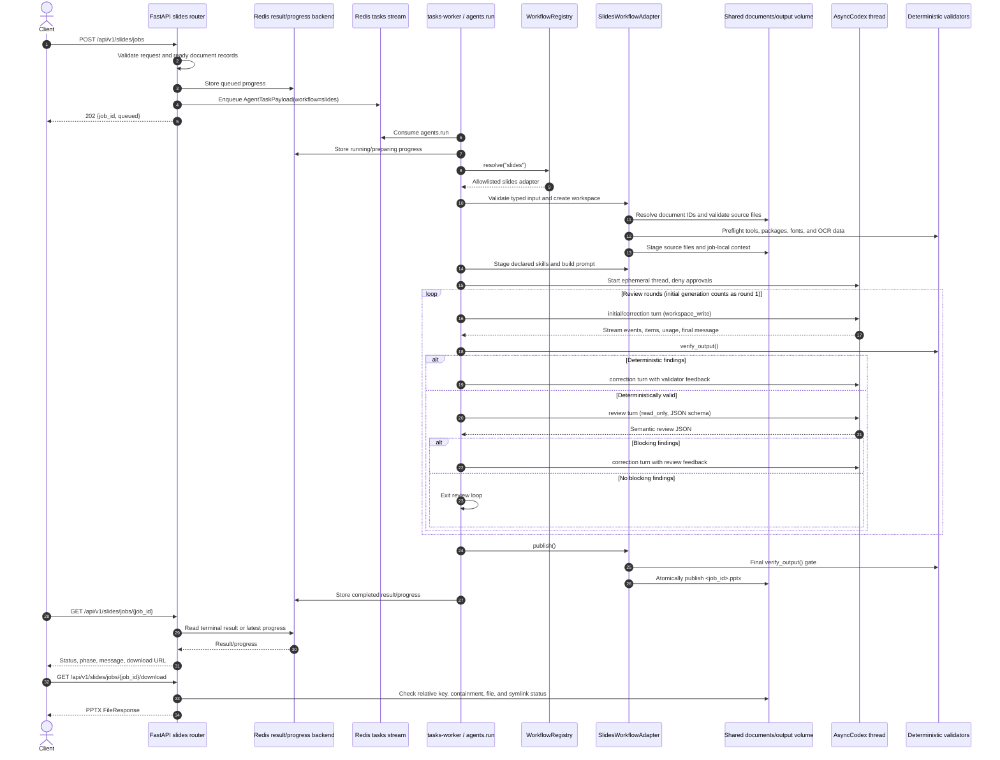

# Backend agentic workflow

Last reviewed: 2026-08-27

This report describes the current implementation in the backend. The generic
agentic framework lives in `app/services/agentic`; its only registered workflow
today is `slides`, implemented by `app/services/slides/adapter.py`. The chat
and document-ingestion services are separate pipelines and are not part of
this Codex workflow.

## Executive summary

The active path is asynchronous and has one queue entrypoint:

```text
POST /api/v1/slides/jobs
  -> validate and record queued state
  -> enqueue agents.run on the tasks Redis stream
  -> resolve the allowlisted slides adapter
  -> prepare an isolated job workspace
  -> run Codex generation and bounded review/correction turns
  -> deterministically validate the deck
  -> publish an atomic PPTX artifact
  -> expose progress, status, and download through the API
```

The queue payload contains an opaque job ID, the literal workflow name
`slides`, and typed, path-free slide input. Client data never selects a Python
module, shell command, skill path, or absolute filesystem path.

## Runtime topology

| Layer | Responsibility | Primary code |
| --- | --- | --- |
| FastAPI | Validate the request, create the job ID, write queued progress, enqueue, poll, and download | [`app/api/routes/slides.py`](app/api/routes/slides.py) |
| Task boundary | Consume the single generic `agents.run` task and translate worker progress/results to Redis | [`app/tasks/agents.py`](app/tasks/agents.py) |
| Contracts | Define payloads, terminal statuses, public phases, turn requests, and adapter protocol | [`app/services/agentic/contracts.py`](app/services/agentic/contracts.py) |
| Registry | Resolve a simple workflow name from an explicit allowlist | [`app/services/agentic/registry.py`](app/services/agentic/registry.py) |
| Orchestrator | Run adapter lifecycle hooks and the deterministic/semantic review loop | [`app/services/agentic/service.py`](app/services/agentic/service.py) |
| Codex runner | Start the isolated Codex thread, stream events, persist audits, enforce timeout, and schedule follow-up turns | [`app/services/agentic/runner.py`](app/services/agentic/runner.py) |
| Slides adapter | Supply slide-specific input preparation, prompt, validators, review parser, publisher, and cleanup policy | [`app/services/slides/adapter.py`](app/services/slides/adapter.py) |
| Filesystem layer | Resolve source IDs, stage source files and skills, validate artifacts, and publish output | [`app/services/virtual_fs/local.py`](app/services/virtual_fs/local.py), [`app/services/slides/artifacts.py`](app/services/slides/artifacts.py) |
| Worker launcher | Run the isolated `tasks` Taskiq worker that imports `app.tasks.agents` | [`app/worker.py`](app/worker.py) |

## End-to-end workflow



### 1. API admission and enqueue

`POST /api/v1/slides/jobs` accepts [`GenerateSlidesRequest`](app/models/slides.py):

- `document_ids`: 1–20 unique UUIDs
- `slides_count`: 5–25
- nonblank `title`, free-form `guidance`, and `formal` or `casual` `tone`

The route checks every selected document before creating a job: it must exist,
be `ready`, and use one of `.pdf`, `.docx`, `.md`, `.markdown`, or `.txt`. The
route then writes a `queued` progress record, creates a `SlidesTaskPayload`,
wraps it in `AgentTaskPayload(workflow="slides")`, and queues it with the same
UUID as the Taskiq task ID. The client receives HTTP 202 immediately.

Relevant code: [`create_slides_job`](app/api/routes/slides.py#L286),
[`GenerateSlidesRequest`](app/models/slides.py#L28), and
[`SlidesTaskPayload`](app/models/slides.py#L79).

### 2. Generic worker boundary

The `tasks-worker` consumes the `tasks` Redis stream and imports
`app.tasks.agents`. The decorated `agents.run` task:

1. Validates the strict `AgentTaskPayload` (`extra="forbid"` and simple-name
   checks for job/workflow values).
2. Writes `running` / `preparing` progress.
3. Builds a `CodexRunner` from settings and calls `execute_workflow`.
4. Writes the terminal progress record and returns an `AgentTaskResult`.

The registry resolves only registered adapters. The built-in `slides` adapter
is registered on import and is also lazily ensured by the process-wide default
registry. An unknown workflow fails before a workspace or Codex session is
created.

Relevant code: [`agents.run`](app/tasks/agents.py#L39),
[`WorkflowRegistry`](app/services/agentic/registry.py#L13), and
[`execute_workflow`](app/services/agentic/service.py#L239).

### 3. Workspace and input preparation

The generic service creates `<AGENT_JOBS_ROOT>/<job_id>` and performs a
symlink/containment check. The slides adapter then prepares the job-local
workspace and:

1. Creates the standard `input/`, `template/`, `work/`, and `output/` tree.
2. Creates a job-local fontconfig file when CJK fonts are available.
3. Resolves each document UUID inside the worker from
   `<DOCUMENTS_ROOT>/<uuid>/<single-source-file>`.
4. Rejects missing, multi-file, symlinked, non-regular, escaped, or unsupported
   sources.
5. Runs preflight checks for Python packages, Node modules, LibreOffice,
   fontconfig/CJK fonts, and PDF-specific Tesseract dependencies.
6. Copies the source files into `input/` and records staged names/font context
   in `work/slide_context.json`.
7. Copies only the adapter-declared skills into
   `.agents/skills/`: `source-document-extraction` and `pptx-nhi-tw`.
8. Builds and saves the compact brief as `work/prompt.md`.

The prompt treats `input/` as untrusted source data. For DOCX/PDF sources it
requires source extraction before evidence-first PPTX generation; the skills
own the detailed extraction, evidence mapping, rendering, and QA instructions.

Relevant code: [`SlidesWorkflowAdapter.prepare_workspace`](app/services/slides/adapter.py#L64),
[`SlidesWorkflowAdapter.prepare_input`](app/services/slides/adapter.py#L73),
[`stage_declared_skills`](app/services/agentic/staging.py#L24), and
[`build_prompt`](app/services/slides/runtime.py#L26).

### 4. Codex execution and bounded review loop

`CodexRunner` starts one ephemeral `AsyncCodex` thread with:

- the job workspace as current directory;
- the configured model and API key;
- `ApprovalMode.deny_all`;
- workspace-write as the default thread sandbox;
- a total timeout (45 minutes by default) and 60-second heartbeats.

Each turn receives the staged skills plus a text prompt. The runner streams
SDK events, maps them to a fixed public progress vocabulary, extracts the final
agent message, captures token usage, and incrementally persists
`work/codex_result.json` and `work/progress.jsonl`.

For the current slides adapter, the generic service runs this sequence:

1. **Initial generation** — a workspace-write `initial` turn.
2. **Deterministic validation** — `verify_output()` checks the generated deck
   and required artifacts.
3. **Semantic review** — only after deterministic validation passes, a
   read-only `review` turn returns exactly `summary`, `blocking_findings`, and
   `findings` JSON.
4. **Correction** — any deterministic finding or blocking semantic finding
   creates a workspace-write `correction` turn on the same Codex thread.
5. **Repeat** — the initial generation is review round 1; the adapter's
   `AGENT_MAX_REVIEW_ROUNDS` setting bounds further rounds (default 3).
6. **Publish** — the loop exits only when the semantic review has no blocking
   findings.

Review feedback is JSON-serialized and capped at 12,000 characters. A malformed
review response is a workflow failure; an unexpected validator exception also
fails closed rather than triggering another model turn.

Relevant code: [`CodexRunner.run`](app/services/agentic/runner.py#L219),
[`_execute_workflow`](app/services/agentic/service.py#L79),
[`validate_generated`](app/services/slides/adapter.py#L114), and
[`parse_review`](app/services/slides/adapter.py#L127).

### 5. Final validation, publication, and cleanup

The adapter validates again during `publish()`, then publishes the deck as
`<AGENT_OUTPUT_ROOT>/<job_id>.pptx`. Publication copies to a destination-local
temporary file and uses an exclusive hard link, so an existing artifact is not
overwritten by a replayed job ID.

`verify_output()` requires a valid PPTX/OOXML ZIP, at least one slide, the
EvidenceMap/content/review/QA reports, source extraction artifacts for DOCX/PDF
jobs, passing skill validators, and exactly one valid final PNG render per
slide. Only the relative artifact key and sanitized download filename cross
the task boundary.

Successful workspaces are removed. Failed workspaces are retained by default
for server-side diagnosis and are removed only when
`AGENT_KEEP_WORKSPACE_ON_FAILURE=false`.

Relevant code: [`SlidesWorkflowAdapter.publish`](app/services/slides/adapter.py#L166),
[`verify_output`](app/services/slides/artifacts.py#L229), and
[`publish_output`](app/services/slides/artifacts.py#L258).

## Public lifecycle and state

The task status and the user-facing phase are separate but related:

| Status | Phase | Meaning |
| --- | --- | --- |
| `queued` | `queued` | API accepted the job and recorded it before enqueueing |
| `running` | `preparing` | Worker owns the job and is preparing inputs/workspace |
| `running` | `drafting` | Codex is generating or updating the deck |
| `running` | `validating` | Deterministic artifact checks are running |
| `running` | `reviewing` | Codex is semantically reviewing the candidate read-only |
| `running` | `revising` | A correction turn is addressing findings |
| `running` | `publishing` | Final validation and output publication are running |
| `completed` | `completed` | The PPTX is available for download |
| `failed` | `failed` | The job stopped without a publishable result |

`GET /api/v1/slides/jobs/{job_id}` reads both result and progress concurrently.
A terminal result takes precedence; otherwise the latest progress metadata is
translated to the public response. Result/progress records are stored in Redis
with a one-hour result retention window.

`GET /api/v1/slides/jobs/{job_id}/download` requires a completed result and
rejects absolute artifact keys, `..` traversal, symlinks, missing files, and
paths outside `AGENT_OUTPUT_ROOT` before returning the PPTX.

## Safety and failure behavior

- **Allowlisting:** workflow names resolve through `WorkflowRegistry`; payloads
  cannot import modules or choose commands/skills.
- **Path safety:** job IDs, workflow names, skill names, source resolution, and
  output keys have independent simple-name/containment checks.
- **Sandboxing:** generation/correction turns can write only in the job
  workspace; semantic review is read-only; Codex approvals are denied.
- **Safe public errors:** paths, secrets, credentials, tracebacks, and SDK
  details are removed from progress and terminal API responses.
- **Advisory telemetry:** progress callback failures do not change the workflow
  result; detailed SDK events remain in the job-local audit log.
- **Timeout:** the runner and outer service enforce the total workflow deadline.
- **Fail closed:** failed validation, malformed review JSON, missing provider
  configuration, and operational failures do not publish an artifact.
- **Retry behavior:** there is currently no automatic retry or dead-letter
  policy for agent jobs. Internal failures become a safe failed task result.

## Active path versus compatibility path

The active queue path is:

```text
routes/slides.py
  -> tasks/agents.py: agents.run
  -> services/agentic/service.py: execute_workflow
  -> services/agentic/registry.py: slides
  -> services/slides/adapter.py
  -> services/agentic/runner.py: CodexRunner
```

`app/tasks/slides.py` and `app/services/slides/agent.py` are retained as
in-process compatibility helpers. `generate_slides_task` is intentionally not
decorated or registered with a broker, and its older `run_codex()` path is not
used by new slide jobs. New workflows should add a typed adapter and register
it with the generic registry rather than adding another Taskiq entrypoint.

## Configuration and operations

The task worker is started with `python -m app.worker tasks`. Defaults are:

| Setting | Default | Purpose |
| --- | --- | --- |
| `OPENAI_MODEL` | `gpt-5.6-luna` | Codex model |
| `AGENT_TIMEOUT_MINUTES` | `45` | Total workflow deadline |
| `AGENT_MAX_REVIEW_ROUNDS` | `3` | Initial generation plus bounded corrections/reviews |
| `AGENT_KEEP_WORKSPACE_ON_FAILURE` | `true` | Retain failed workspaces for diagnosis |
| `AGENT_JOBS_ROOT` | `/tmp/agents/jobs` | Temporary job workspaces |
| `AGENT_OUTPUT_ROOT` | `/tmp/agents/output` | Published PPTX files |
| `DOCUMENTS_ROOT` | `/tmp/documents` | UUID-scoped source files |
| `TASKS_WORKER_PROCESSES` | `2` | Taskiq worker processes |
| `TASKS_WORKER_MAX_ASYNC_TASKS` | `2` | Concurrent async tasks per process |

The API and task worker must share `REDIS_URL`, `DOCUMENTS_ROOT`,
`AGENT_JOBS_ROOT`, and `AGENT_OUTPUT_ROOT`. The shared filesystem carries
source files, workspaces, and published artifacts; Redis carries transport,
progress, and short-lived task results.

## Source map

- [`app/services/agentic/contracts.py`](app/services/agentic/contracts.py) — public contracts and adapter protocol
- [`app/services/agentic/service.py`](app/services/agentic/service.py) — lifecycle orchestration and review loop
- [`app/services/agentic/runner.py`](app/services/agentic/runner.py) — Codex SDK integration, streaming, audits, timeout
- [`app/services/agentic/staging.py`](app/services/agentic/staging.py) — declared-skill staging
- [`app/tasks/agents.py`](app/tasks/agents.py) — sole generic agent Taskiq task
- [`app/services/slides/adapter.py`](app/services/slides/adapter.py) — current registered `slides` workflow
- [`app/services/slides/artifacts.py`](app/services/slides/artifacts.py) — preflight, validation, publication, cleanup
- [`app/services/virtual_fs/local.py`](app/services/virtual_fs/local.py) — worker-side UUID-to-file resolution
- [`app/api/routes/slides.py`](app/api/routes/slides.py) — public queue/status/download API
- [`app/models/slides.py`](app/models/slides.py) — HTTP and task-boundary slide models
- [`tests/services/agentic/test_framework.py`](tests/services/agentic/test_framework.py) — generic loop, timeout, and safety coverage
- [`tests/infrastructure/test_workers.py`](tests/infrastructure/test_workers.py) — broker separation and sole-entrypoint assertions
