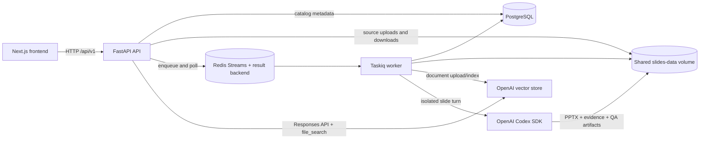
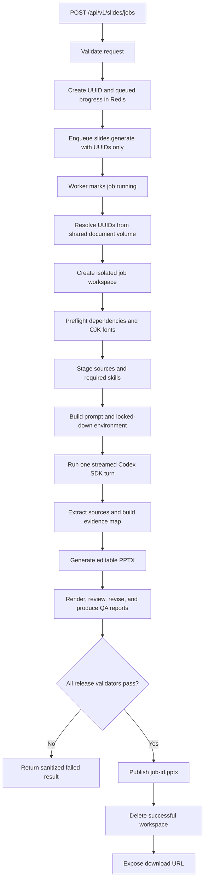

# NHI-AI backend

The backend is a FastAPI application with two Taskiq background pipelines:

- document ingestion into an OpenAI vector store for source-grounded Q&A;
- evidence-first PowerPoint generation from previously uploaded documents.

PostgreSQL stores document, folder, and ingestion metadata. Uploaded source files and generated PowerPoint files live on a shared filesystem volume. Redis Streams carries asynchronous tasks and stores short-lived task progress/results. News ingestion and news generation are intentionally outside the current scope.

The repository-level setup guide is in [../README.md](../README.md). This document describes the backend package as it exists now.

## Architecture at a glance



### Runtime responsibilities

| Component | Current responsibility |
|---|---|
| FastAPI process | Validates requests, manages document/folder records, saves uploads, enqueues jobs, reports job state, serves downloads, and handles grounded chat requests. |
| PostgreSQL | Stores `Document`, `Folder`, and `IngestionJob` rows. It stores metadata and opaque OpenAI IDs, not document binary content. |
| Shared `slides-data` volume | Stores original documents, temporary slide workspaces, and published `.pptx` files. Both the API and worker mount the same volume. |
| Redis | Provides the Taskiq Redis Stream queue and stores task progress plus terminal results for one hour. Both document and slide tasks currently use the `slides` queue. |
| Taskiq worker | Runs document ingestion and slide generation outside the request/response process. Compose limits the worker to one process and one asynchronous task at a time. |
| OpenAI vector store | Holds indexed copies of uploaded documents used by `file_search`. Every indexed source is tagged with its application document ID and non-news metadata. |
| Codex slide runtime | Works inside a per-job directory with staged source files, two local skills, offline dependencies, and workspace-write-only permissions. |

## Data ownership

The system deliberately keeps different data in different stores:

```text
PostgreSQL
  document identity, filename, checksum, category, status, storage key,
  folder relationship, retrieval flags, and opaque provider IDs

/data/documents/<document UUID>/<safe filename>
  the original uploaded file bytes

Redis
  serialized Taskiq payloads, sanitized progress, and terminal task results

/data/jobs/<slide job UUID>/
  temporary slide inputs, skills, audit files, renders, and QA artifacts

/data/output/<slide job UUID>.pptx
  the published presentation
```

Only UUIDs cross the slide queue boundary. Absolute source paths are resolved by the worker from the shared volume and absolute artifact paths are never returned to the client.

## Complete backend file tree

The tree below includes the backend's source, tests, configuration, bundled agent skills, and runtime assets. Generated or sensitive paths are intentionally excluded: `.env`, `.venv/`, `node_modules/`, `graphify-out/`, `.pytest_cache/`, and `__pycache__/`.

```text
backend/
├── .env.example
├── .gitignore
├── .python-version
├── Dockerfile
├── README.md
├── package.json
├── package-lock.json
├── pyproject.toml
├── uv.lock
├── app/
│   ├── __init__.py
│   ├── main.py                         # FastAPI assembly, lifecycle, DI, health routes
│   ├── config.py                       # Environment-backed settings
│   ├── db.py                           # SQLModel engine, tables, request sessions
│   ├── broker.py                       # Redis Stream broker and result backend
│   ├── api/
│   │   └── routes/
│   │       ├── __init__.py
│   │       ├── chat.py                 # Grounded chat and SSE endpoints
│   │       ├── documents.py            # Document/folder CRUD and ingestion status
│   │       └── slides.py               # Slide create, poll, and download endpoints
│   ├── models/
│   │   ├── __init__.py
│   │   ├── chat.py                     # Chat request/response contracts
│   │   ├── documents.py                # SQLModel tables and document API contracts
│   │   ├── slides.py                   # Public and queue-level slide contracts
│   │   └── virtual_fs.py               # Virtual-filesystem contracts
│   ├── tasks/
│   │   ├── __init__.py
│   │   ├── documents.py                # documents.ingest Taskiq task
│   │   └── slides.py                   # slides.generate Taskiq task
│   └── services/
│       ├── __init__.py
│       ├── chat/
│       │   ├── __init__.py
│       │   ├── citations.py            # Provider citation normalization
│       │   ├── responder.py            # OpenAI Responses API adapter
│       │   └── retrieval.py            # file_search tool and metadata filters
│       ├── documents/
│       │   ├── __init__.py
│       │   ├── repository.py           # Repository protocol, SQLModel and test implementations
│       │   └── storage.py              # Secure shared-volume upload storage
│       ├── virtual_fs/
│       │   ├── __init__.py
│       │   └── local.py                 # UUID-to-source-path worker resolver
│       └── slides/
│           ├── __init__.py
│           ├── agent.py                 # Top-level slide orchestration facade
│           ├── artifacts.py             # Workspaces, staging, preflight, validation, publish
│           ├── contracts.py             # JobError and progress callback contracts
│           ├── runtime.py               # Prompt, environment, Codex SDK execution
│           ├── fonts/
│           │   ├── NotoSansTC-Black.ttf
│           │   ├── NotoSansTC-Bold.ttf
│           │   ├── NotoSansTC-ExtraBold.ttf
│           │   ├── NotoSansTC-ExtraLight.ttf
│           │   ├── NotoSansTC-Light.ttf
│           │   ├── NotoSansTC-Medium.ttf
│           │   ├── NotoSansTC-Regular.ttf
│           │   ├── NotoSansTC-SemiBold.ttf
│           │   ├── NotoSansTC-Thin.ttf
│           │   ├── NotoSansTC-VariableFont_wght.ttf
│           │   ├── NotoSerifTC-Black.ttf
│           │   ├── NotoSerifTC-Bold.ttf
│           │   ├── NotoSerifTC-ExtraBold.ttf
│           │   ├── NotoSerifTC-ExtraLight.ttf
│           │   ├── NotoSerifTC-Light.ttf
│           │   ├── NotoSerifTC-Medium.ttf
│           │   ├── NotoSerifTC-Regular.ttf
│           │   ├── NotoSerifTC-SemiBold.ttf
│           │   └── NotoSerifTC-VariableFont_wght.ttf
│           └── .agents/
│               └── skills/
│                   ├── source-document-extraction/
│                   │   ├── SKILL.md
│                   │   ├── agents/
│                   │   │   └── openai.yaml
│                   │   ├── references/
│                   │   │   ├── artifact-format.md
│                   │   │   └── source-extraction.schema.json
│                   │   └── scripts/
│                   │       ├── extract_sources.py
│                   │       ├── source_extraction.py
│                   │       └── validate_sources.py
│                   └── pptx-nhi-tw/
│                       ├── SKILL.md
│                       ├── agents/
│                       │   └── openai.yaml
│                       ├── assets/
│                       │   ├── nhi_logo_large.png
│                       │   └── nhi_logo_small.png
│                       ├── references/
│                       │   ├── generation-gotchas.md
│                       │   ├── nhi-zh-tw.md
│                       │   ├── qa.md
│                       │   └── template-editing.md
│                       ├── schemas/
│                       │   ├── evidence_map_v1.json
│                       │   ├── qa_report_v1.json
│                       │   └── review_report_v1.json
│                       └── scripts/
│                           ├── __init__.py
│                           ├── _upstream.py
│                           ├── add_slide.py
│                           ├── check_pptx_content.py
│                           ├── clean.py
│                           ├── contracts.py
│                           ├── qa_report.py
│                           ├── review_report.py
│                           ├── thumbnail.py
│                           ├── validate_evidence_map.py
│                           └── office/
│                               ├── soffice.py
│                               └── validate.py
├── scripts/
│   └── migrate_nhiqa.py                # Legacy NHI-QA metadata migration utility
└── tests/
    ├── api/
    │   └── test_slides.py
    ├── services/
    │   ├── chat/
    │   │   ├── test_chat.py
    │   │   └── test_stream.py
    │   ├── documents/
    │   │   ├── test_repository.py
    │   │   └── test_storage.py
    │   ├── slides/
    │   │   └── test_main.py
    │   └── virtual_fs/
    │       └── test_local.py
    └── tasks/
        └── test_slides.py
```

## How the backend starts

`app.main` constructs the application and installs production dependency overrides:

1. The lifespan handler calls `SQLModel.metadata.create_all()` through `init_db()`.
2. The API process starts the Taskiq broker client. A Taskiq worker manages its own broker lifecycle.
3. Document and chat routes receive a request-scoped `SQLModelDocumentRepository` backed by PostgreSQL or the configured SQLite database.
4. The chat service receives the configured OpenAI model, vector-store ID, and a mapper from OpenAI file IDs back to local document UUIDs.
5. Chat, document, and slide routers are mounted under `/api/v1`.
6. Shutdown closes Redis and the API-owned broker connection.

`GET /health/live` proves that the process is alive. `GET /health` also checks Redis and the database and returns `503` if either dependency is unavailable.

The current schema bootstrap uses `create_all`, not a versioned migration framework. Existing-table migrations therefore require an explicit migration step or script.

## Current feature flows

### Document ingestion

1. `POST /api/v1/documents` validates the extension/MIME type and streams the upload to a temporary file in the shared document volume.
2. Storage enforces the size limit, computes a SHA-256 checksum, sanitizes the filename, and atomically moves the file to `<documents-root>/<document-id>/<filename>`.
3. The API creates the `Document` and `IngestionJob` rows and enqueues `documents.ingest` with opaque IDs and a category.
4. The worker resolves the local source, uploads it to OpenAI Files, and attaches it to the configured vector store with `document_id`, `qa_set`, `content_type`, and `is_news_source=false` attributes.
5. PostgreSQL is updated to `ready` with the opaque provider IDs. Failures mark both rows as `failed` with a safe error.

Supported upload extensions are currently `.pdf`, `.docx`, `.md`, `.markdown`, and `.txt`. Valid categories are `legislative_qa`, `public_opinion`, and `bei_can`; there is no news category.

### Source-grounded chat

1. `POST /api/v1/chat` or `/chat/stream` validates every explicitly selected document against PostgreSQL.
2. Selected documents must match the requested category, be `ready`, and have retrieval enabled.
3. `ResponseService` calls the OpenAI Responses API with a `file_search` tool constrained to the configured vector store, category, optional document IDs, and `is_news_source=false`.
4. Provider citations are normalized and remote file IDs are mapped back to local document UUIDs.
5. If the final answer has no source citation, the backend replaces it with `無法回答，因為無相關資料`. The streaming route buffers answer deltas until final citations are known, preventing ungrounded text from being emitted.

## Slides pipeline workflow

The slides API is asynchronous because extraction, generation, rendering, revision, and validation can take several minutes.



### 1. API acceptance and queueing

`POST /api/v1/slides/jobs` accepts:

```json
{
  "title": "健保政策簡報",
  "document_ids": ["00000000-0000-0000-0000-000000000000"],
  "slides_count": 10,
  "guidance": "Emphasize the policy timeline and evidence.",
  "tone": "formal"
}
```

The API validates a nonblank title, 1–20 unique document UUIDs, an exact requested length of 5–25 slides, and a `formal` or `casual` tone. It creates a job UUID, writes `queued` progress, and enqueues a `SlidesTaskPayload` using that same UUID as the Taskiq task ID. The response is immediate:

```json
{
  "job_id": "<uuid>",
  "status": "queued"
}
```

The payload contains document UUIDs, never filesystem paths, provider credentials, or file bytes.

### 2. Worker-side source resolution

`generate_slides_task()` changes the job to `running` and uses `SharedVolumeDocumentResolver` to resolve each ID as:

```text
<SLIDES_DOCUMENTS_ROOT>/<document UUID>/<exactly one regular source file>
```

The resolver rejects missing or multiple files, symlinks, path escapes, non-regular files, and unsupported extensions. Its accepted set is `.pdf`, `.docx`, `.txt`, `.md`, `.rtf`, `.csv`, and `.xlsx`. This does not exactly match the upload API: uploads accept `.markdown`, but the slide resolver does not; the resolver accepts `.rtf`, `.csv`, and `.xlsx`, but the upload API does not. Consequently, an uploaded `.markdown` document can be indexed for chat but currently fails slide source resolution.

### 3. Isolated workspace and preflight

`generate_slides()` creates this job-local structure:

```text
<SLIDES_JOBS_ROOT>/<job UUID>/
├── .agents/skills/
│   ├── source-document-extraction/
│   └── pptx-nhi-tw/
├── input/                             # Copies of resolved sources
├── template/                          # Optional presentation template
├── output/
│   └── presentation.pptx              # Required candidate deck
└── work/
    ├── prompt.md
    ├── codex_result.json               # Job-local SDK audit
    ├── final_message.txt
    ├── progress.jsonl
    ├── extracted/
    │   └── manifest.json               # Required for PDF/DOCX
    ├── images/
    ├── rendered/final/*.png            # One final render per slide
    └── intermediate/
        ├── evidence_map.json
        ├── content_check.json
        ├── review_report.json
        └── qa_report.json
```

Before the model runs, preflight verifies:

- Python packages required for OOXML, images, and PDF extraction;
- Node modules `pptxgenjs`, `sharp`, `react`, `react-dom`, and `react-icons`;
- LibreOffice for rendering and visual validation;
- fontconfig plus a Traditional-Chinese/CJK-safe font;
- Tesseract with `chi_tra` and `eng` data when any source is a PDF.

The worker creates a job-specific fontconfig file, copies only the two required local skills, copies source files into `input/`, and writes the compact brief to `work/prompt.md`.

### 4. Codex generation turn

`runtime.py` starts one ephemeral Codex thread rooted at the job directory. The runtime uses:

- the configured `OPENAI_MODEL`;
- workspace-write sandboxing and denied approval prompts;
- `source-document-extraction` for PDF/DOCX sources;
- `pptx-nhi-tw` for NHI styling, evidence mapping, deck construction, rendering, revision, and QA;
- an offline dependency environment (`PIP_NO_INDEX`, `UV_OFFLINE`, and npm offline mode);
- a configurable timeout, currently 45 minutes by default;
- streamed safe progress updates and a 60-second heartbeat.

The prompt explicitly treats `input/` as untrusted source data rather than instructions. For PDF/DOCX inputs, deterministic extraction runs first and produces block-level IDs/locators. The presentation skill maps slide claims to those source blocks, creates an editable native PowerPoint, renders every slide, reviews it, revises problems, and produces the required evidence and QA artifacts.

### 5. Release validation

The service does not publish a deck merely because a `.pptx` exists. `verify_output()` requires all of the following:

1. `output/presentation.pptx` is a valid OOXML ZIP, is larger than 10 KB, and contains at least one slide.
2. `evidence_map.json`, `content_check.json`, `review_report.json`, and `qa_report.json` exist.
3. PDF/DOCX jobs include a valid extraction manifest and evidence map linked to extracted source blocks.
4. The review report matches the candidate PPTX and final render set.
5. The content checker reports no configured findings.
6. The QA report validates against the PPTX and evidence map.
7. The number of valid final PNG renders exactly equals the deck's slide count.

Any failed check prevents publication.

### 6. Publication, polling, and download

After validation, the candidate is moved to `<SLIDES_OUTPUT_ROOT>/<job UUID>.pptx`. The worker returns only a relative artifact key and a sanitized filename, marks progress `completed`, and removes the successful workspace. A failed workspace is retained by default for server-side diagnosis, while clients receive only `Presentation generation failed.`

Clients poll `GET /api/v1/slides/jobs/{job_id}`. A completed response includes a download URL:

```json
{
  "job_id": "<uuid>",
  "status": "completed",
  "stage": "completed",
  "message": "Presentation is ready for download.",
  "download_url": "/api/v1/slides/jobs/<uuid>/download"
}
```

The download route accepts only a completed result, resolves the relative key under the output root, and rejects absolute paths, `..`, path escapes, symlinks, and missing files. Redis progress/results expire after one hour; the published PPTX remains until separately cleaned up.

Slide job states are:

```text
queued -> running -> completed
                  \-> failed
```

There is currently no automatic retry for slide generation. The task catches internal exceptions and stores a sanitized terminal failure so SDK errors, paths, tracebacks, and credentials do not cross the public API boundary.

## API surface

All application routes are under `/api/v1` except health endpoints.

| Method | Route | Purpose |
|---|---|---|
| `GET` | `/health/live` | Process liveness. |
| `GET` | `/health` | Redis and database readiness. |
| `GET` | `/api/v1/qa-modes` | List supported Q&A categories. |
| `POST` | `/api/v1/chat` | Return one grounded answer. |
| `POST` | `/api/v1/chat/stream` | Stream a grounded answer as SSE. |
| `POST` | `/api/v1/documents` | Upload a document and enqueue ingestion. |
| `GET` | `/api/v1/documents` | Filter and list documents. |
| `POST` | `/api/v1/documents/folders` | Create a folder. |
| `GET` | `/api/v1/documents/folders` | List folders. |
| `PATCH` | `/api/v1/documents/folders/{folder_id}` | Rename a folder. |
| `DELETE` | `/api/v1/documents/folders/{folder_id}` | Delete an empty folder. |
| `GET` | `/api/v1/documents/{document_id}` | Read document metadata. |
| `PATCH` | `/api/v1/documents/{document_id}` | Update document metadata. |
| `DELETE` | `/api/v1/documents/{document_id}` | Mark deleting and remove the local source. |
| `GET` | `/api/v1/documents/{document_id}/download` | Download the original source. |
| `GET` | `/api/v1/documents/{document_id}/ingestion` | Read the latest ingestion job. |
| `POST` | `/api/v1/slides/jobs` | Queue a presentation job. |
| `GET` | `/api/v1/slides/jobs/{job_id}` | Poll progress or terminal status. |
| `GET` | `/api/v1/slides/jobs/{job_id}/download` | Download a completed presentation. |

FastAPI's interactive OpenAPI UI is available at `http://localhost:8000/docs` while the API is running.

## Configuration

Copy the example file before starting locally or through Compose:

```bash
cp backend/.env.example backend/.env
```

| Variable | Purpose | Current default |
|---|---|---|
| `REDIS_URL` | Task queue, progress, and result Redis connection. | Required |
| `OPENAI_API_KEY` | OpenAI Files/vector store, Responses API, and Codex SDK credential. | Required |
| `OPENAI_MODEL` | Slide-generation Codex model. | `gpt-5.6-luna` |
| `OPENAI_CHAT_MODEL` | Grounded chat model. | `gpt-5.6-luna` |
| `OPENAI_VECTOR_STORE_ID` | Shared non-news retrieval index. | Optional setting, required for ingestion/chat |
| `DATABASE_URL` | SQLModel database connection. | `sqlite:///./nhi_ai.db` |
| `SLIDES_JOBS_ROOT` | Temporary slide job workspaces. | `/tmp/slides/jobs` |
| `SLIDES_DOCUMENTS_ROOT` | Original shared document storage. | `/tmp/slides/documents` |
| `SLIDES_OUTPUT_ROOT` | Published PPTX storage. | `/tmp/slides/output` |
| `SLIDES_TIMEOUT_MINUTES` | Maximum Codex turn duration. | `45` |
| `SLIDES_KEEP_WORKSPACE_ON_FAILURE` | Retain failed workspaces for diagnosis. | `true` |
| `MAX_UPLOAD_BYTES` | Maximum document upload size. | `262144000` (250 MiB) |

Do not commit `.env`; it contains the API key.

## Run with Docker Compose

From the repository root:

```bash
docker compose up --build
```

This starts PostgreSQL, Redis, FastAPI, one Taskiq worker, and the frontend. Compose overrides the backend paths to `/data/jobs`, `/data/documents`, and `/data/output`, all backed by the `slides-data` volume shared by `backend` and `worker`.

```bash
curl http://localhost:8000/health/live
curl http://localhost:8000/health
docker compose logs -f backend worker
```

## Run locally

The slide worker also requires Node.js, LibreOffice Impress, fontconfig/CJK fonts, and Tesseract with Traditional Chinese and English data. The Docker image installs these; for a native run they must already be available on the host.

From `backend/`:

```bash
cp .env.example .env
uv sync
npm ci
uv run uvicorn app.main:app --reload --host 0.0.0.0 --port 8000
```

In another terminal:

```bash
uv run taskiq worker app.broker:broker app.tasks.slides app.tasks.documents \
  --workers 1 --max-async-tasks 1
```

For host-native Redis, set `REDIS_URL=redis://localhost:6379/0`. Keep the API and worker on the same database and filesystem roots; otherwise the worker cannot resolve uploads or publish files that the API can serve.

## Tests

From `backend/`:

```bash
uv run pytest
```

The suite covers slide API contracts, safe job progress/results, worker resolution/failure handling, slide orchestration, chat grounding/streaming, document repository/storage behavior, and shared-volume path safety.
