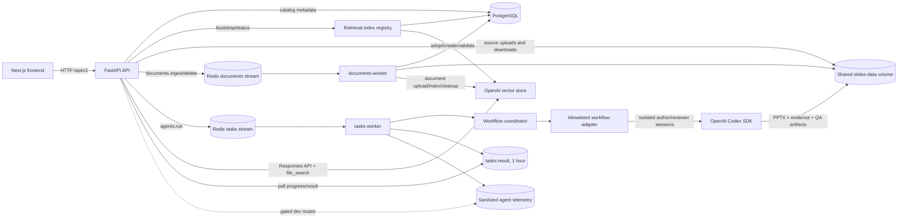
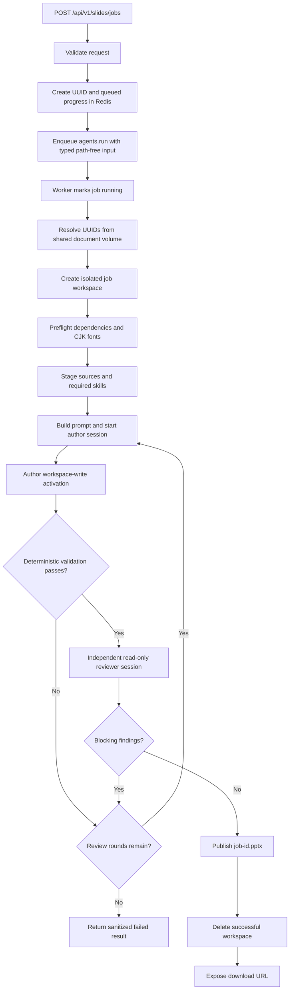

# NHI-AI backend

The backend is a FastAPI application with two independently tunable Taskiq pipelines:

- document ingestion into an OpenAI vector store for source-grounded Q&A;
- generic Codex-backed agent workflows, whose first registered workflow is evidence-first PowerPoint generation from previously uploaded documents.

The generic worker has one stable task entrypoint, `agents.run`. It accepts only a typed job ID, an explicit workflow name, and workflow input. A registry maps that name to an adapter; the current adapter is `slides`. PostgreSQL stores document, folder, ingestion, and primary retrieval-index state. Uploaded source files and generated PowerPoint files live on a shared filesystem volume. Redis Streams carries asynchronous tasks, short-lived job progress/results, and sanitized development telemetry. News ingestion and news generation are intentionally outside the current scope.

The repository-level setup guide is in [../README.md](../README.md). This document describes the backend package as it exists now.

## Architecture at a glance



### Runtime responsibilities

| Component                   | Current responsibility                                                                                                                                              |
| --------------------------- | ------------------------------------------------------------------------------------------------------------------------------------------------------------------- |
| FastAPI process             | Validates requests, initializes schema, bootstraps retrieval state, manages document/folder records, enqueues jobs, reports status, serves downloads, and handles grounded chat. |
| PostgreSQL                  | Stores `Document`, `Folder`, `IngestionJob`, and singleton `RetrievalIndex` rows. It stores metadata and opaque OpenAI IDs, not document binary content.            |
| Shared `slides-data` volume | Stores original documents, temporary agent workspaces, and published artifacts. API and both workers mount the same volume.                                      |
| Redis                       | Provides separate `documents` and `tasks` Taskiq Redis Streams. Agent progress/results expire after one hour; sanitized development telemetry expires separately.  |
| Taskiq workers              | `documents-worker` handles `documents.ingest` and `documents.delete` (1 process/4 async tasks); `tasks-worker` handles `agents.run` (2 processes/2 async tasks).     |
| OpenAI vector store         | Holds indexed copies of uploaded documents used by `file_search`. Every indexed source is tagged with its application document ID and non-news metadata.            |
| Agent runtime               | Resolves only allowlisted workflows/runners. The `slides` adapter coordinates isolated author and reviewer sessions and publishes only after deterministic and semantic gates pass. |

## Data ownership

The system deliberately keeps different data in different stores:

```text
PostgreSQL
  document identity, filename, checksum, category, status, storage key,
  folder relationship, retrieval flags, opaque provider IDs, and the durable
  primary retrieval-index lifecycle record

/data/documents/<document UUID>/<safe filename>
  the original uploaded file bytes

Redis
  serialized Taskiq payloads, sanitized progress, terminal task results, and
  optional expiring agent-run snapshots/events

/data/jobs/<agent job UUID>/
  temporary workflow inputs, staged skills, audit files, and workflow artifacts

/data/output/<agent job UUID>.pptx
  the published presentation produced by the current slides workflow
```

Queue payloads contain opaque identifiers and typed, path-free workflow input. Absolute source paths are resolved by workers from the shared volume, and absolute artifact paths are never returned to the client.

## Backend layout

The maintained package boundaries are:

```text
backend/
├── .env.example
├── Dockerfile
├── README.md
├── package.json                         # PPTX-generation Node dependencies
├── pyproject.toml                       # Python 3.13 application/test dependencies
├── .agents/
│   └── skills/                          # versioned, allowlisted workflow skills
│       ├── source-document-extraction/
│       └── pptx-nhi-tw/
├── app/
│   ├── main.py                         # FastAPI assembly, lifecycle, DI, health routes
│   ├── config.py                       # Environment-backed settings
│   ├── db.py                           # SQLModel engine, tables, request sessions
│   ├── broker.py                       # Separate document/task brokers and result backend
│   ├── worker.py                       # Settings-driven documents/tasks worker launcher
│   ├── api/
│   │   └── routes/
│   │       ├── chat.py                 # Grounded chat and SSE endpoints
│   │       ├── documents.py            # Document/folder CRUD and ingestion status
│   │       ├── retrieval.py             # Safe vector-store/document readiness status
│   │       ├── slides.py                # Slide create, poll, and download endpoints
│   │       └── dev_agents.py            # Gated sanitized agent telemetry endpoints
│   ├── models/
│   │   ├── chat.py                     # Chat request/response contracts
│   │   ├── documents.py                # SQLModel tables and document API contracts
│   │   ├── retrieval.py                # Durable singleton retrieval-index state
│   │   ├── slides.py                   # Public and queue-level slide contracts
│   │   └── virtual_fs.py               # Virtual-filesystem contracts
│   ├── tasks/
│   │   ├── documents.py                # documents.ingest/delete Taskiq tasks
│   │   ├── slides.py                   # deprecated in-process compatibility helper
│   │   └── agents.py                   # stable agents.run worker import boundary
│   └── services/
│       ├── agentic/
│       │   ├── contracts.py            # provider-neutral task/runner/adapter contracts
│       │   ├── coordinator.py          # public workflow coordinator facade
│       │   ├── events.py               # Redis-backed sanitized run telemetry
│       │   ├── registry.py             # explicit workflow allowlist
│       │   ├── runner.py               # runner allowlist and Codex implementation
│       │   ├── runners/                # provider/registry compatibility exports
│       │   ├── service.py              # bounded author/validator/reviewer lifecycle
│       │   └── staging.py              # declared-skill staging
│       ├── chat/
│       │   ├── citations.py            # Provider citation normalization
│       │   ├── responder.py            # OpenAI Responses API adapter
│       │   └── retrieval.py            # file_search tool and metadata filters
│       ├── documents/
│       │   ├── repository.py           # Repository protocol, SQLModel and test implementations
│       │   └── storage.py              # Secure shared-volume upload storage
│       ├── retrieval/
│       │   └── registry.py              # Cross-process vector-store adoption/provisioning
│       ├── virtual_fs/
│       │   └── local.py                 # UUID-to-source-path worker resolver
│       └── slides/
│           ├── adapter.py               # Registered slides WorkflowAdapter
│           ├── agent.py                 # legacy in-process compatibility facade
│           ├── artifacts.py             # Workspaces, staging, preflight, validation, publish
│           ├── contracts.py             # JobError and progress callback contracts
│           ├── runtime.py               # legacy prompt/runtime compatibility helpers
│           └── fonts/                   # bundled Traditional-Chinese font assets
├── scripts/
│   └── migrate_nhiqa.py                # Legacy NHI-QA metadata migration utility
└── tests/
    ├── api/                             # slide, retrieval, and dev-route contracts
    ├── infrastructure/                  # worker topology
    ├── services/                        # agentic/chat/document/retrieval/slide/VFS tests
    └── tasks/                           # document and agent task behavior
```

## How the backend starts

`app.main` constructs the application and installs production dependency overrides:

1. The lifespan handler calls `SQLModel.metadata.create_all()` through `init_db()`.
2. The API performs a best-effort validation of the database-backed primary OpenAI vector store. Provider failure is recorded as a safe retrieval state and does not stop the process from serving catalog/status requests.
3. The API process starts both Taskiq producer brokers. A Taskiq worker manages its own broker lifecycle.
4. Document, chat, and retrieval routes receive request-scoped SQLModel-backed dependencies.
5. The chat service resolves the vector-store ID from the durable registry and maps OpenAI file IDs back to local document UUIDs.
6. Chat, document, retrieval, and slide routers are mounted under `/api/v1`; development agent routes are mounted only when `ENABLE_AGENT_DEV_ROUTES=true`.
7. Shutdown closes Redis and both API-owned producer broker connections, including
   partial-startup cleanup if the second broker cannot start.

`GET /health/live` proves that the process is alive. `GET /health` also checks Redis and the database and returns `503` if either dependency is unavailable. Retrieval/provider readiness is separate and is reported by `GET /api/v1/retrieval/status`.

The current schema bootstrap uses `create_all`, not a versioned migration framework. Existing-table migrations therefore require an explicit migration step or script.

## Current feature flows

### Document ingestion

1. `POST /api/v1/documents` validates the extension/MIME type and streams the upload to a temporary file in the shared document volume.
2. Storage enforces the size limit, computes a SHA-256 checksum, sanitizes the filename, and atomically moves the file to `<documents-root>/<document-id>/<filename>`.
3. The API creates the `Document` and `IngestionJob` rows and enqueues `documents.ingest` with opaque IDs and a category.
4. The worker ensures the database-backed vector store exists, resolves the local source, uploads it to OpenAI Files, and attaches it with `document_id`, `qa_set`, `content_type`, and `is_news_source=false` attributes.
5. PostgreSQL is updated to `ready` with the opaque provider IDs. Failures mark both rows as `failed` with a safe error.

`DELETE /api/v1/documents/{document_id}` is also asynchronous. It immediately disables retrieval, marks the row `deleting`, and queues `documents.delete`. The worker detaches/deletes provider resources, removes the local source, then removes ingestion and document rows. A provider or storage failure leaves a `delete_failed` row that can be retried with the same endpoint. Deletion is rejected while ingestion is queued or running to avoid remote-resource races.

Supported upload extensions are currently `.pdf`, `.docx`, `.md`, `.markdown`, and `.txt`. Valid categories are `legislative_qa`, `public_opinion`, and `bei_can`; there is no news category.

### Source-grounded chat

1. `POST /api/v1/chat` or `/chat/stream` validates every explicitly selected document against PostgreSQL.
2. Selected documents must match the requested category, be `ready`, and have retrieval enabled.
3. `ResponseService` calls the OpenAI Responses API with a `file_search` tool constrained to the database-backed vector store, category, optional document IDs, and `is_news_source=false`. Requests with no retrieval-ready documents return a stable empty-corpus conflict before contacting OpenAI.
4. Provider citations are normalized and remote file IDs are mapped back to local document UUIDs.
5. If the final answer has no source citation, the backend replaces it with `無法回答，因為無相關資料`. The streaming route buffers answer deltas until final citations are known, preventing ungrounded text from being emitted.

## Generic agent workflow

All Codex-backed work crosses one Taskiq boundary: `agents.run`. It accepts an `AgentTaskPayload` containing only `job_id`, `workflow`, and `input`. The payload is strict and rejects extra fields; it cannot name a Python import, command, skill directory, runner, or source path. `WorkflowRegistry` resolves `workflow` from an explicit in-process allowlist, so an unknown workflow fails safely before a workspace or SDK session is created. Runner selection is server-side and resolved from a separate allowlist; `codex` is currently the only registered runner.

An adapter owns its domain policy: typed input/output, preparation, declared skills, prompt construction, deterministic validation, optional semantic review, publication, and cleanup. The generic service owns the operational lifecycle:

1. Validate the typed input, create a UUID-contained workspace, prepare inputs, and stage only the adapter's declared skills from `backend/.agents/skills`.
2. Create an author activation in a workspace-write sandbox with denied approvals and safe streamed progress/heartbeats.
3. Run the adapter's deterministic validator after each author attempt. Correctable findings build a new revision prompt and start a fresh author activation.
4. If the candidate is valid, create an independent reviewer activation in a read-only sandbox with a structured output schema. Blocking findings become feedback for another fresh author activation.
5. Stop after the adapter's bounded review limit; publish only a fully accepted result. Per-attempt audits live under `work/agents/<node>/attempt-<n>.json`; failed workspaces are retained or removed according to `AGENT_KEEP_WORKSPACE_ON_FAILURE`.

The current `slides` adapter supplies the review hooks, making the author/validator/reviewer loop active. Each activation receives an independent ephemeral provider session: reviewers cannot mutate author state, and later author attempts do not inherit hidden conversational state. A workflow without review hooks still uses the same isolated runner, staging, timeout, and safe result boundary.

### Adding an allowlisted workflow

Add a typed adapter under its domain service rather than adding a Taskiq task per workflow. The adapter should inherit `BaseWorkflowAdapter` (or implement `WorkflowAdapter`), declare its exact skill names, and return a typed published result. Add its skills under `backend/.agents/skills/<skill-name>/`, register the adapter in `WorkflowRegistry`, and ensure its module is imported by the task worker so registration occurs. A public API route can then translate its request into `AgentTaskPayload(workflow="<name>", input=...)` and enqueue `agents.run`.

The generic worker remains the only Codex queue entrypoint. Workflow scripts, if required, belong to an allowlisted staged skill or adapter implementation; they are never selected or executed from queue payload data.

## Slides workflow (current `slides` adapter)

The slides API is asynchronous because extraction, generation, rendering, revision, and validation can take several minutes.



### 1. API acceptance and queueing

`POST /api/v1/slides/jobs` accepts:

```json
{
    "title": "健保政策簡報",
    "document_ids": ["00000000-0000-0000-0000-000000000000"],
    "slides_count": 10,
    "guidance": "Emphasize the policy timeline and evidence.",
    "tone": "formal"
}
```

The API validates a nonblank title, 1–20 unique document UUIDs, an exact requested length of 5–25 slides, and a `formal` or `casual` tone. It creates a job UUID, writes `queued` progress, and enqueues an `AgentTaskPayload` with `workflow="slides"` and the typed slide input using that same UUID as the Taskiq task ID. The response is immediate:

```json
{
    "job_id": "<uuid>",
    "status": "queued"
}
```

The payload contains document UUIDs, never filesystem paths, provider credentials, or file bytes.

### 2. Worker-side source resolution

The generic `agents.run` task resolves the registered `slides` adapter. Its preparation hook changes the job to `running` and uses `SharedVolumeDocumentResolver` to resolve each ID as:

```text
<DOCUMENTS_ROOT>/<document UUID>/<exactly one regular source file>
```

The resolver rejects missing or multiple files, symlinks, path escapes, non-regular files, and unsupported extensions. Its accepted set is `.pdf`, `.docx`, `.txt`, `.md`, `.rtf`, `.csv`, and `.xlsx`. This does not exactly match the upload API: uploads accept `.markdown`, but the slide resolver does not; the resolver accepts `.rtf`, `.csv`, and `.xlsx`, but the upload API does not. Consequently, an uploaded `.markdown` document can be indexed for chat but currently fails slide source resolution.

### 3. Isolated workspace and preflight

The slides adapter creates this job-local structure:

```text
<AGENT_JOBS_ROOT>/<job UUID>/
├── .agents/skills/
│   ├── source-document-extraction/
│   └── pptx-nhi-tw/
├── input/                             # Copies of resolved sources
├── template/                          # Optional presentation template
├── output/
│   └── presentation.pptx              # Required candidate deck
└── work/
    ├── prompt.md
    ├── final_message.txt
    ├── agents/
    │   ├── author/attempt-<n>.json      # Per-session provider audits
    │   └── reviewer/attempt-<n>.json
    ├── extracted/
    │   └── manifest.json               # Required for PDF/DOCX
    ├── images/
    ├── rendered/final/*.png            # One final render per slide
    └── intermediate/
        ├── evidence_map.json
        ├── content_check.json
        ├── review_report.json
        └── qa_report.json
```

Before the model runs, preflight verifies:

- Python packages required for OOXML, images, and PDF extraction;
- Node modules `pptxgenjs`, `sharp`, `react`, `react-dom`, and `react-icons`;
- LibreOffice for rendering and visual validation;
- fontconfig plus a Traditional-Chinese/CJK-safe font;
- Tesseract with `chi_tra` and `eng` data when any source is a PDF.

The agent worker creates a job-specific fontconfig file, copies only the two required local skills, copies source files into `input/`, and writes the compact brief to `work/prompt.md`.

Filesystem traversal, skill/source staging, preflight subprocesses, deterministic
validators, publication, cleanup, and document-provider I/O run in worker threads
so the configured async-task concurrency is not serialized by blocking calls.

### 4. Agent generation and review loop

The coordinator creates a separate `AgentExecutionRequest` for each author attempt and reviewer activation. The Codex runner adapter gives each request its own ephemeral Codex thread rooted at the job directory. This prevents the read-only reviewer from sharing or modifying author session state and makes every revision depend only on the persisted workspace plus explicit feedback. The runtime uses:

- the configured `OPENAI_MODEL`;
- workspace-write sandboxing for generation/correction, read-only sandboxing for semantic review, and denied approval prompts;
- `source-document-extraction` for PDF/DOCX sources;
- `pptx-nhi-tw` for NHI styling, evidence mapping, deck construction, rendering, revision, and QA;
- an offline dependency environment (`PIP_NO_INDEX`, `UV_OFFLINE`, and npm offline mode);
- a configurable timeout, currently 45 minutes by default;
- streamed safe progress updates and a 60-second heartbeat;
- short-lived sanitized run/node/event telemetry in Redis for the optional development console;
- a bounded `AGENT_MAX_REVIEW_ROUNDS` loop (default 3): deterministic validation runs before semantic review, blocking findings produce a fresh author attempt, and publication is reached only after both gates pass.

The prompt explicitly treats `input/` as untrusted source data rather than instructions. For PDF/DOCX inputs, deterministic extraction runs first and produces block-level IDs/locators. The presentation skill maps slide claims to those source blocks, creates an editable native PowerPoint, renders every slide, reviews it, revises problems, and produces the required evidence and QA artifacts.

### 5. Release validation

The service does not publish a deck merely because a `.pptx` exists. Deterministic validation runs after every write-capable turn, and `verify_output()` requires all of the following before semantic review or publication:

1. `output/presentation.pptx` is a valid OOXML ZIP, is larger than 10 KB, and contains at least one slide.
2. `evidence_map.json`, `content_check.json`, `review_report.json`, and `qa_report.json` exist.
3. PDF/DOCX jobs include a valid extraction manifest and evidence map linked to extracted source blocks.
4. The review report matches the candidate PPTX and final render set.
5. The content checker reports no configured findings.
6. The QA report validates against the PPTX and evidence map.
7. The number of valid final PNG renders exactly equals the deck's slide count.

Any failed check prevents publication.

### 6. Publication, polling, and download

After validation, the candidate is moved to `<AGENT_OUTPUT_ROOT>/<job UUID>.pptx`. The worker returns only a relative artifact key and a sanitized filename, marks progress `completed`, and removes the successful workspace. A failed workspace is retained by default for server-side diagnosis, while clients receive only `Presentation generation failed.`

Clients poll `GET /api/v1/slides/jobs/{job_id}`. A completed response includes a download URL:

```json
{
    "job_id": "<uuid>",
    "status": "completed",
    "stage": "completed",
    "message": "Presentation is ready for download.",
    "download_url": "/api/v1/slides/jobs/<uuid>/download"
}
```

The download route accepts only a completed result, resolves the relative key under the output root, and rejects absolute paths, `..`, path escapes, symlinks, and missing files. Redis progress/results expire after one hour; the published PPTX remains until separately cleaned up.

Slide job states are:

```text
queued -> running -> completed
                  \-> failed
```

There is currently no automatic retry for slide generation. The task catches internal exceptions and stores a sanitized terminal failure so SDK errors, paths, tracebacks, and credentials do not cross the public API boundary.

## API surface

All application routes are under `/api/v1` except health endpoints.

| Method   | Route                                       | Purpose                                    |
| -------- | ------------------------------------------- | ------------------------------------------ |
| `GET`    | `/health/live`                              | Process liveness.                          |
| `GET`    | `/health`                                   | Redis and database readiness.              |
| `GET`    | `/api/v1/retrieval/status`                  | Safe vector-store state and ready-document count. |
| `GET`    | `/api/v1/qa-modes`                          | List supported Q&A categories.             |
| `POST`   | `/api/v1/chat`                              | Return one grounded answer.                |
| `POST`   | `/api/v1/chat/stream`                       | Stream a grounded answer as SSE.           |
| `POST`   | `/api/v1/documents`                         | Upload a document and enqueue ingestion.   |
| `GET`    | `/api/v1/documents`                         | Filter and list documents.                 |
| `POST`   | `/api/v1/documents/folders`                 | Create a folder.                           |
| `GET`    | `/api/v1/documents/folders`                 | List folders.                              |
| `PATCH`  | `/api/v1/documents/folders/{folder_id}`     | Rename a folder.                           |
| `DELETE` | `/api/v1/documents/folders/{folder_id}`     | Delete an empty folder.                    |
| `GET`    | `/api/v1/documents/{document_id}`           | Read document metadata.                    |
| `PATCH`  | `/api/v1/documents/{document_id}`           | Update document metadata.                  |
| `DELETE` | `/api/v1/documents/{document_id}`           | Queue provider, local-file, and catalog cleanup. |
| `GET`    | `/api/v1/documents/{document_id}/download`  | Download the original source.              |
| `GET`    | `/api/v1/documents/{document_id}/ingestion` | Read the latest ingestion job.             |
| `POST`   | `/api/v1/slides/jobs`                       | Queue a presentation job.                  |
| `GET`    | `/api/v1/slides/jobs/{job_id}`              | Poll progress or terminal status.          |
| `GET`    | `/api/v1/slides/jobs/{job_id}/download`     | Download a completed presentation.         |
| `GET`    | `/api/v1/dev/agent-runs`                    | List sanitized agent-run snapshots.        |
| `GET`    | `/api/v1/dev/agent-runs/{run_id}`           | Read one sanitized run and node snapshot.  |
| `GET`    | `/api/v1/dev/agent-runs/{run_id}/events`    | Page through the run's sanitized events.   |

FastAPI's interactive OpenAPI UI is available at `http://localhost:8000/docs` while the API is running.

The `/api/v1/dev/*` routes are not registered unless `ENABLE_AGENT_DEV_ROUTES=true`. They have no application authentication and are intended only for loopback-bound or otherwise trusted development environments. Prompts, provider responses, paths, commands, and secrets are excluded from their Redis-backed telemetry.

## Configuration

Copy the example file before starting locally or through Compose:

```bash
cp backend/.env.example backend/.env
```

| Variable                           | Purpose                                                             | Current default                               |
| ---------------------------------- | ------------------------------------------------------------------- | --------------------------------------------- |
| `REDIS_URL`                        | Task queue, progress, and result Redis connection.                  | Required                                      |
| `OPENAI_API_KEY`                   | OpenAI Files/vector store, Responses API, and Codex SDK credential. | Required                                      |
| `OPENAI_MODEL`                     | Slide-generation Codex model.                                       | `gpt-5.6-luna`                                |
| `OPENAI_CHAT_MODEL`                | Grounded chat model.                                                | `gpt-5.6-luna`                                |
| `OPENAI_VECTOR_STORE_ID`           | Optional first-run seed for the shared non-news index.              | Omitted: created and persisted automatically  |
| `OPENAI_VECTOR_STORE_NAME`         | Name for an automatically created vector store.                    | `NHI-AI Knowledge Base`                       |
| `OPENAI_VECTOR_STORE_BOOTSTRAP_TIMEOUT_SECONDS` | Provider timeout for store bootstrap.          | `10`                                          |
| `DATABASE_URL`                     | SQLModel database connection.                                       | `sqlite:///./nhi_ai.db`                       |
| `DOCUMENTS_ROOT`                   | Original shared document storage.                                   | `/tmp/documents`                              |
| `AGENT_JOBS_ROOT`                  | Temporary agent job workspaces.                                     | `/tmp/agents/jobs`                             |
| `AGENT_OUTPUT_ROOT`                | Published agent artifacts (including PPTX).                         | `/tmp/agents/output`                           |
| `AGENT_TIMEOUT_MINUTES`            | Total deadline for one agent workflow, including reviews.           | `45`                                          |
| `AGENT_KEEP_WORKSPACE_ON_FAILURE`  | Retain failed workspaces for diagnosis.                             | `true`                                        |
| `AGENT_MAX_REVIEW_ROUNDS`          | Maximum independent author validation/review attempts.              | `3`                                           |
| `AGENT_EVENT_RETENTION_SECONDS`    | TTL for sanitized developer run snapshots/events.                   | `86400` (one day)                             |
| `ENABLE_AGENT_DEV_ROUTES`          | Register unauthenticated development telemetry routes.              | `false`                                       |
| `DOCUMENTS_QUEUE_NAME`             | Redis Stream for document ingestion/deletion.                       | `documents`                                   |
| `TASKS_QUEUE_NAME`                 | Redis Stream for agent jobs.                                         | `tasks`                                       |
| `DOCUMENTS_WORKER_PROCESSES`       | Document worker process count.                                      | `1`                                           |
| `DOCUMENTS_WORKER_MAX_ASYNC_TASKS` | Document async task limit per process.                              | `4`                                           |
| `TASKS_WORKER_PROCESSES`           | Agent worker process count.                                          | `2`                                           |
| `TASKS_WORKER_MAX_ASYNC_TASKS`     | Agent async task limit per process.                                  | `2`                                           |
| `SLIDES_*`                         | Deprecated aliases; canonical names win when both are set.          | See `.env.example`                            |
| `MAX_UPLOAD_BYTES`                 | Maximum document upload size.                                       | `262144000` (250 MiB)                         |

Worker process and async-task limits are read when each worker starts; change
the settings and restart the affected worker to apply them. There is no dynamic
autoscaling.

Do not commit `.env`; it contains the API key.

`OPENAI_VECTOR_STORE_ID` is optional and only seeds an uninitialized database. If omitted, the API or document worker creates a store named by `OPENAI_VECTOR_STORE_NAME`. Once a store ID is persisted, it remains authoritative; changing the environment value produces a status warning instead of switching corpora. A seed from another OpenAI project/account is usable only when `OPENAI_API_KEY` is authorized to retrieve it. Bootstrap errors are exposed only as stable codes through `/api/v1/retrieval/status` and do not fail `/health/live`.

## Run with Docker Compose

From the repository root:

```bash
docker compose up --build
```

This starts PostgreSQL, Redis, FastAPI, separate document and agent Taskiq workers, and the frontend. Compose overrides the shared paths to `/data/jobs`, `/data/documents`, and `/data/output`, all backed by the `slides-data` volume shared by `backend` and both workers.

```bash
curl http://localhost:8000/health/live
curl http://localhost:8000/health
docker compose logs -f backend documents-worker tasks-worker
```

The published frontend/backend ports bind to `127.0.0.1` by default. To use the developer agent console, set `ENABLE_AGENT_DEV_ROUTES=true` in the repository-root `.env`, restart the stack, and open `http://localhost:3000/dev/agents`. Keep the ports private because these diagnostic routes are intentionally unauthenticated.

## Run locally

The slide worker also requires Node.js, LibreOffice Impress, fontconfig/CJK fonts, and Tesseract with Traditional Chinese and English data. The Docker image installs these; for a native run they must already be available on the host.

From `backend/`:

```bash
cp .env.example .env
uv sync
npm ci
uv run uvicorn app.main:app --reload --host 0.0.0.0 --port 8000
```

In another terminal:

```bash
uv run python -m app.worker documents
# In another terminal:
uv run python -m app.worker tasks
```

For host-native Redis, set `REDIS_URL=redis://localhost:6379/0`. Keep the API and worker on the same database and filesystem roots; otherwise the worker cannot resolve uploads or publish files that the API can serve.

## Tests

From `backend/`:

```bash
uv run pytest
```

The suite covers retrieval-index provisioning/coordination, document ingestion and provider cleanup, grounded chat/citations/streaming, provider-neutral agent contracts, isolated author/reviewer behavior, sanitized telemetry, slide APIs and validation, worker separation, and shared-volume path safety.
